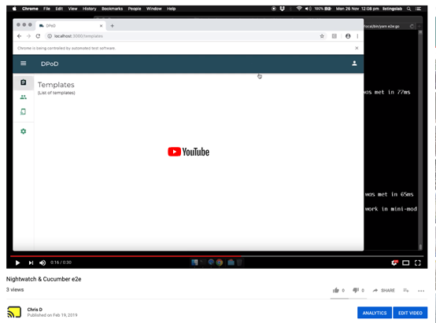
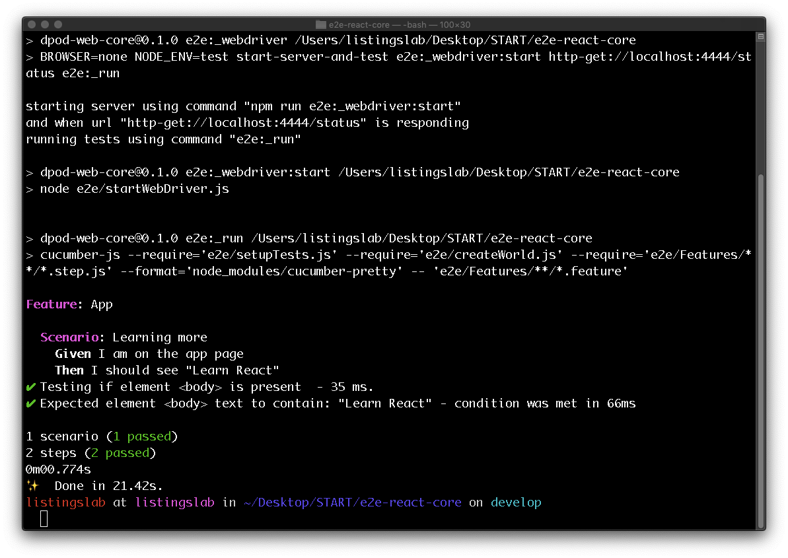

## [Tennis Challenge Sydney](./index.md)

# e2e

[](https://www.youtube.com/watch?v=MugXpi9D78g)

End to End test a react app using cucumber and nightwatch API. Bootstrapped from 
[here](https://github.com/listingslab-software/react-e2e)


## Install

Cucumber e2e testing harness is bootstrapped from 
https://github.com/listingslab-software/react-e2e

```bash
    cd <working-directory>
    git clone https://github.com/listingslab-software/tennis-challenge
    cd tennis-challenge
    npm i
    npm run e2e
```
Output from a passing e2e test would look like this

