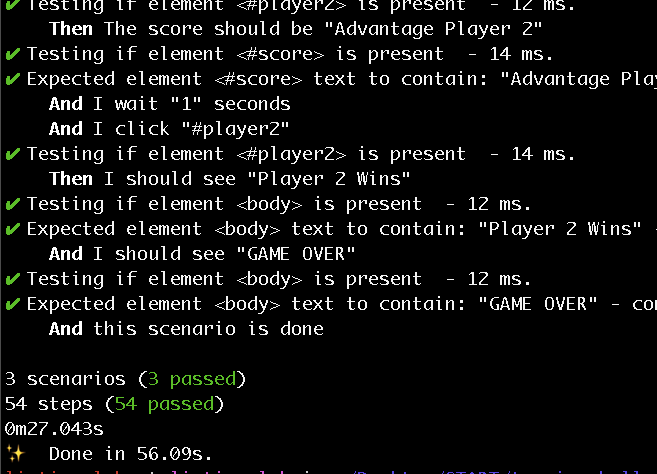

## [Home](./index.md)

# Test Driven Development



[](https://www.youtube.com/watch?v=_3vsosVX9r0)

### Gherkin Feature: Tennis

```bash
Feature: Tennis

  In order to use the app
  As a event organiser
  I want to be be sure the it scores correctly

  Scenario: Player 1 wins by a Whitewash
    Given I am on the tennis page
    And I click "#start-match"
    And I click "#player1"
    Then The score should be "15:0"
    And I click "#player1"
    Then The score should be "30:0"
    And I click "#player1"
    Then The score should be "40:0"
    And I click "#player1"
    Then I should see "Player 1 Wins"
    And I should see "GAME OVER"
    And this scenario is done 
```

The ability to e2e test a react app using cucumber and nightwatch API was bootstrapped from 
[this repo](https://github.com/listingslab-software/react-e2e)

## Install & Run e2e

```bash
    cd <working-directory>
    git clone https://github.com/listingslab-software/tennis-challenge
    cd tennis-challenge
    yarn
    yarn e2e
```

* __developer note__

This e2e tdd approach can be integrated into a CI process,  
and coverage can be outputted, but it's not an exact science yet

Sometimes, especially the first time you run ```yarn e2e```  
it will just fail for no reason. you might see the following:  

```bash
    > node e2e/startWebDriver.js

    connect ECONNREFUSED 127.0.0.1:4444
    
    socket hang up
        at createHangUpError (_http_client.js:331:15)
        at Socket.socketCloseListener (_http_client.js:363:23)
```

Ignore it and try running re-run the command again


NEXT => [JavaScript Class](https://listingslab-software.github.io/tennis-challenge-sydney/javascript.html)